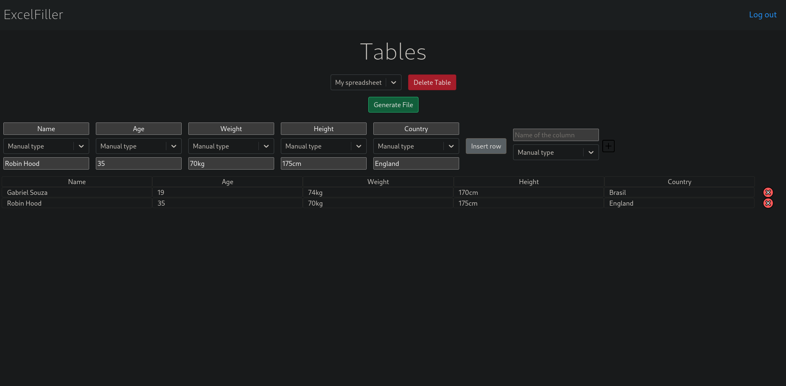

# ExcelFiller
<h1>Usability</h1>

Save repetitive data to a database and create spreadsheets quickly with these.

This web app is currently hosted on https://excelfiller.com
<h1>RoadMap</h1>
<h2>Data types<h2>
  <ul>
    <li>Manual Text: type manually data - (Finished)</li>
    <li>Registered Items: register items by category and select it afterwards - (To do)</li>
    <li>Manual Date: type manually text in date format - (To do)</li>
    <li>Automatic Date: insert automatically dates into your spread sheet - (To do)</li>
  </ul>
<h2>Login and Register</h2>
  
Having an account will be useful and necessary to save all your tables and saved data

  
I intend to implement Google Login for easier registering

<h2>Project Current State</h2>
</img>
